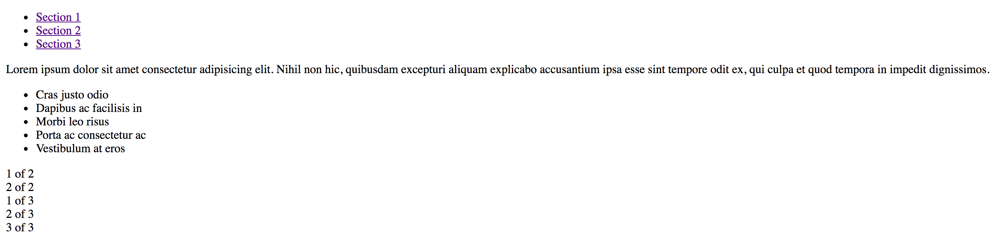
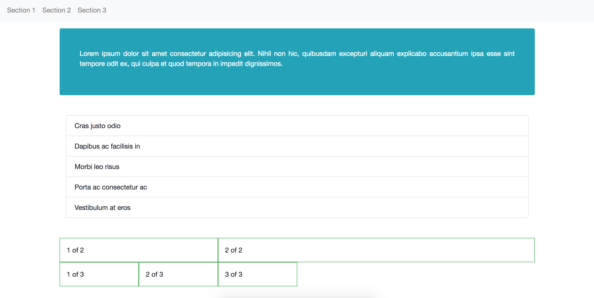

# Activity 1
In this activity, we'll experiement with Bootstrap's [components](https://getbootstrap.com/docs/4.0/components/buttons/), [utilities](https://getbootstrap.com/docs/4.0/utilities/borders/), and [grid layout](https://getbootstrap.com/docs/4.0/layout/grid/). Follow the instructions in the comments of your `index.html` file to complete the activity. We'll achieve our desired styles _without_ writing our own CSS (instead, we'll just apply the Bootstrap styles). 

Here is the page **without** Bootstrap styles:

And here is the page **with** Bootstrap styles:

I suggest you open the [Bootstrap CSS File](https://maxcdn.bootstrapcdn.com/bootstrap/4.0.0-beta/css/bootstrap.css) in your browser so you can see what styles get applied to each class as you go along. See `complete` branch for answers.